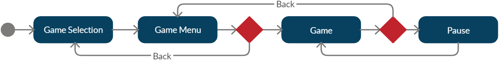
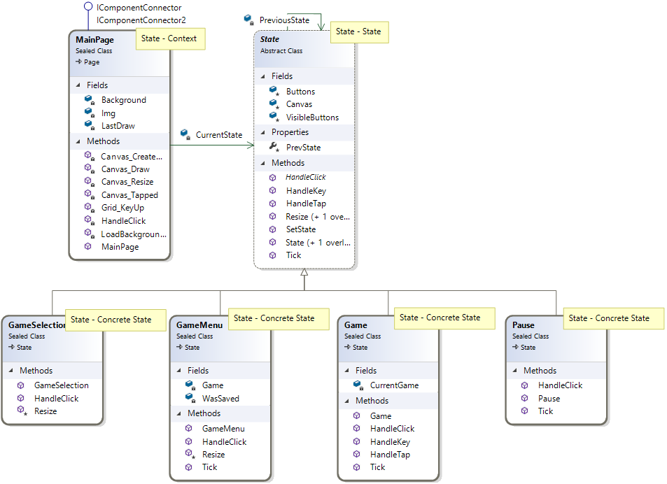
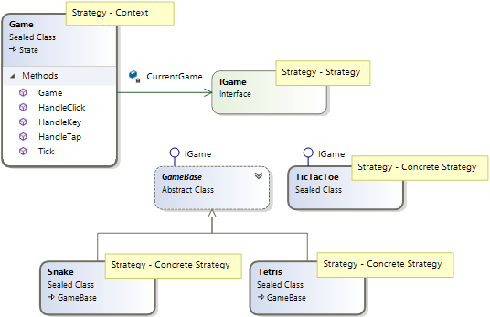
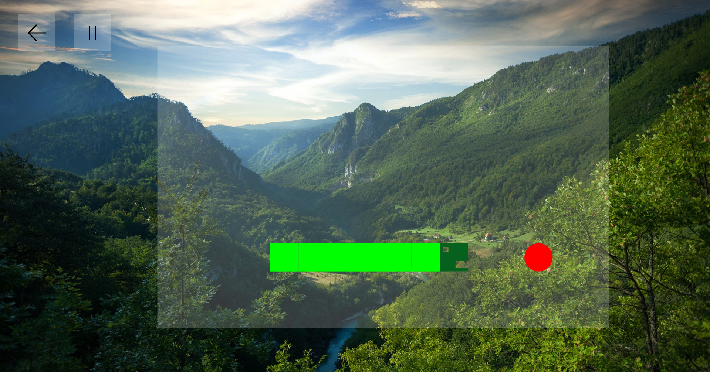
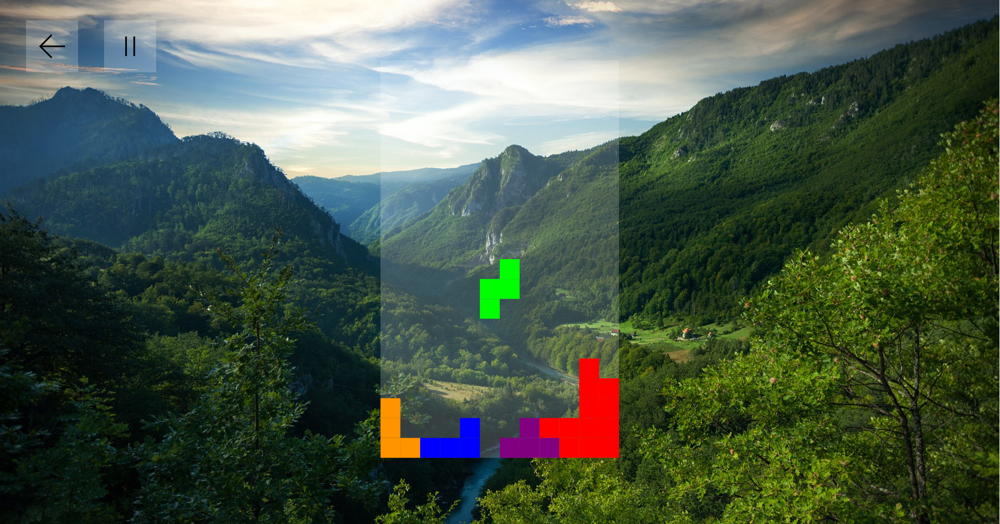
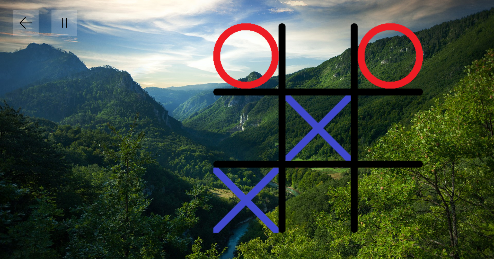

#  UWP Mini Games
Simple Universal Windows Platform Games

Implemented in C#

Project is based on State pattern (consisting of 4 states, switching between states is performed in button clicks):
1. Game Selection (Home Screen, Game Selection - All available games)
2. Game Menu (Concrete Game's Menu - New Game or Continue)
3. Game (Playing game)
4. Pause (Game Paused)

Games are implemented as Strategy Pattern

Uses both Keyboard and mouse (touchcsreen) inputs

## Snake
- Uses only Key input (WASD or Arrows)

## Tetris
- Uses only Key input (A,D,R, Left and Right Arrow)

## Tic-Tac-Toe
- For "AI" was used MinMax algorithm
- Uses only moude / touch input

## Changelog
### 1.0.0.0
- Created 4 UI states
- Tic-Tac-Toe Game
- Snake Game
### 1.1.0.0
- Added Tetris Game
- Refactoring of Snake Game
 
