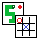
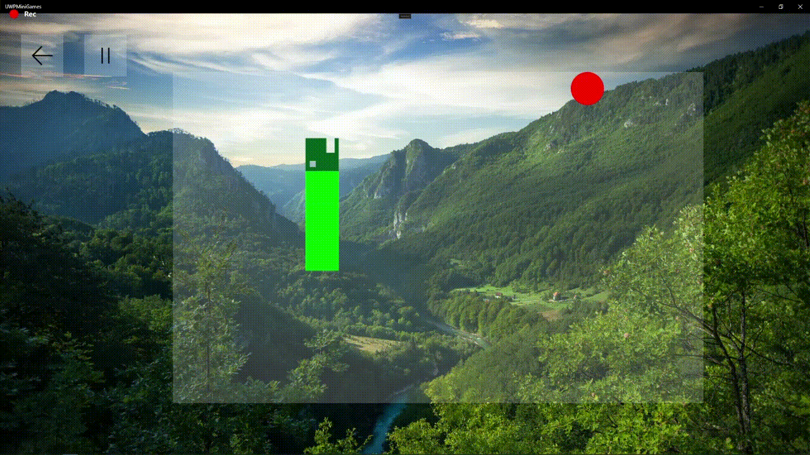
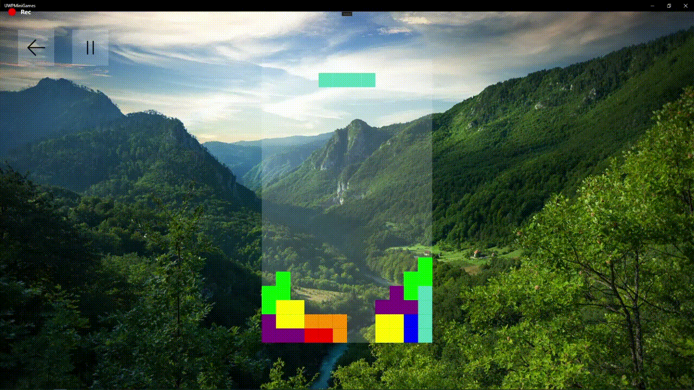
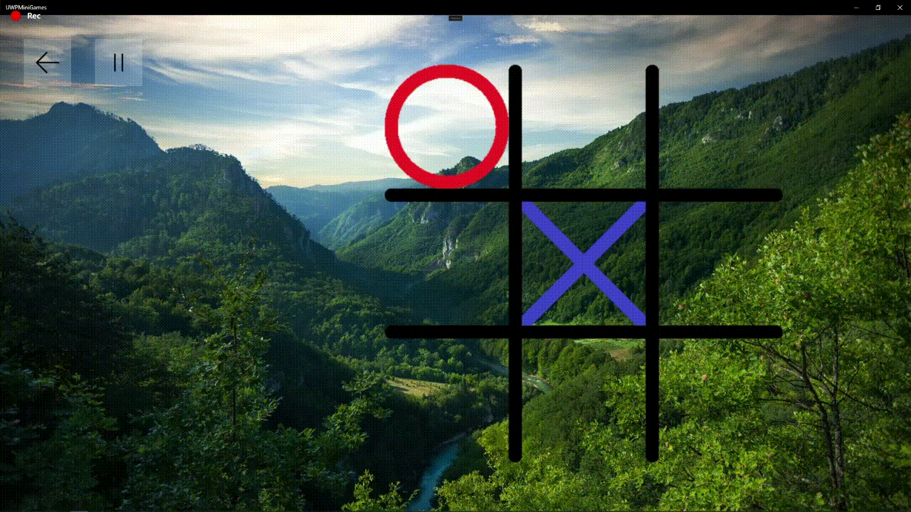
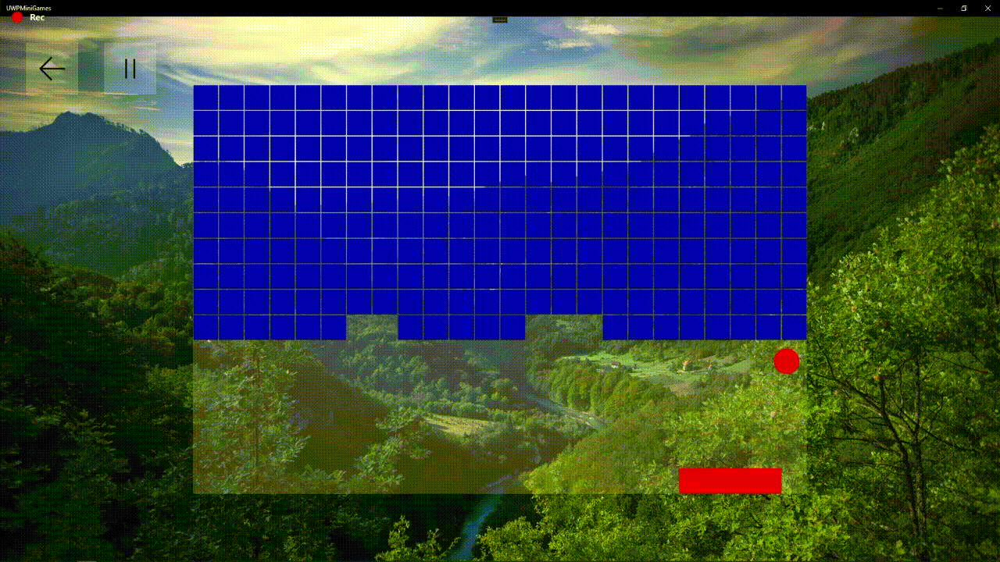
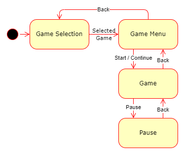
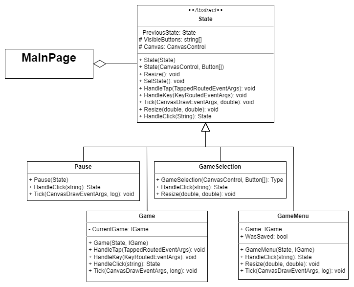
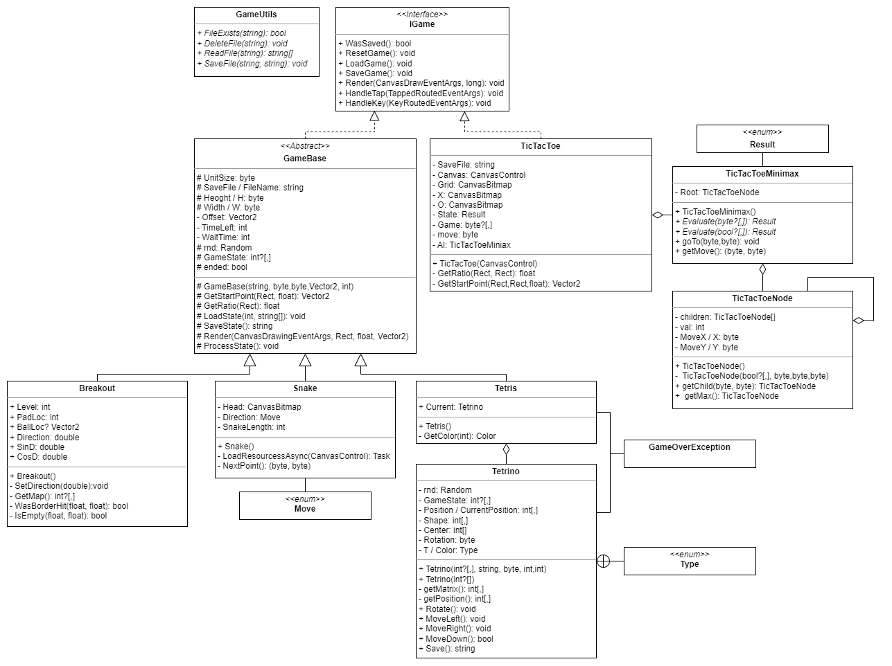

#  UWP Mini Games
- Simple Universal Windows Platform (UWP) Games
- MS Visual Studio (2022) Project
- C#
- Uses both Keyboard and mouse (touchcsreen) inputs

# Demo

### Raspberry PI with Windows 10 IoT Core

## Snake
- Uses only Key input (WASD or Arrows)

## Tetris
- Uses only Key input (A,D,R, Left and Right Arrow)

## Tic-Tac-Toe
- For "AI" was used MinMax algorithm
- Uses only mouse / touch input

## Breakout
- Uses only Key input (A,D, Left and Right Arrow)
- Bounce direction is randomised (±0.2 rad)

# Architecture
## State Machine
State Machine is implemented as State pattern (consisting of 4 states, switching between states is performed in button clicks):
1. Game Selection (Home Screen, Game Selection - All available games)
2. Game Menu (Concrete Game's Menu - New Game or Continue)
3. Game (Playing game)
4. Pause (Game Paused)

Abstract class State specifies all allowed transitions and concrete states override supported transitions.

## Strategy
Games are implemented as Strategy Pattern

# Changelog
## 1.0.0
- Created 4 UI states
- Tic-Tac-Toe Game
- Snake Game
## 1.1.0
- Added Tetris Game
- Refactoring of Snake Game
## 1.2.0
- Added Breakout Game
 
